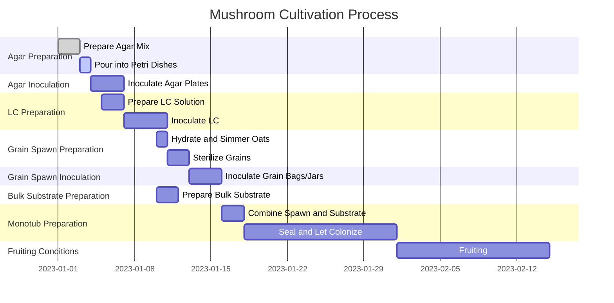

# mycology

```mermaid
gantt
    dateFormat  YYYY-MM-DD
    title       Mushroom Cultivation Process

    section Agar Preparation
    Prepare Agar Mix                 :done,    agar1, 2023-01-01, 2d
    Pour into Petri Dishes           :active,  agar2, after agar1, 1d

    section Agar Inoculation
    Inoculate Agar Plates            :         inoc1, after agar2, 3d

    section LC Preparation
    Prepare LC Solution              :         lc1, 2023-01-05, 2d
    Inoculate LC                     :         lc2, after lc1, 4d

    section Grain Spawn Preparation
    Hydrate and Simmer Oats          :         oats1, 2023-01-10, 1d
    Sterilize Grains                 :         oats2, after oats1, 2d

    section Grain Spawn Inoculation
    Inoculate Grain Bags/Jars        :         inog, after oats2, 3d

    section Bulk Substrate Preparation
    Prepare Bulk Substrate           :         bulk1, 2023-01-10, 2d

    section Monotub Preparation
    Combine Spawn and Substrate      :         mono1, after inog, 2d
    Seal and Let Colonize            :         mono2, after mono1, 14d

    section Fruiting Conditions
    Fruiting                         :         fruit, after mono2, 14d
```
