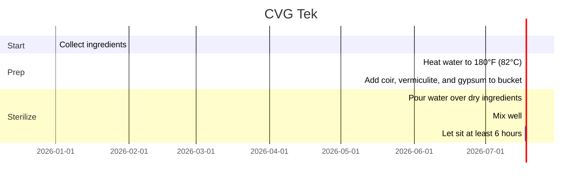
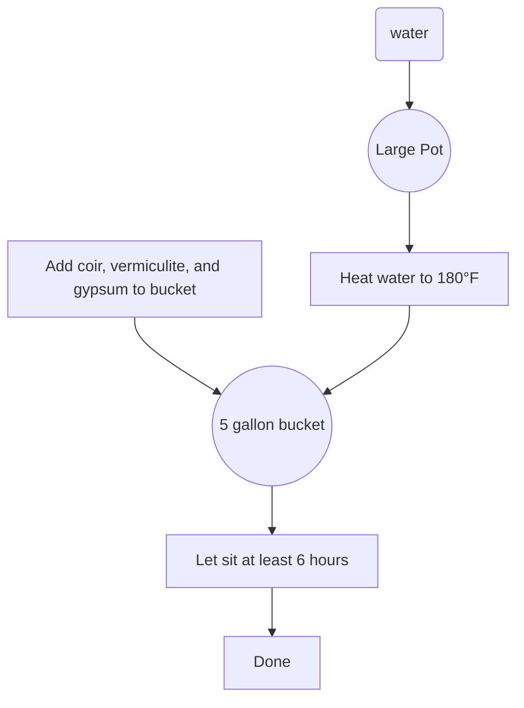

# CVG
Coir, Vermiculite, Gypsum

## Ingredients, by weight

- 2 parts coir
- 1 part vermiculite
- 1 part gypsum
- 10 parts water

## Instructions

1. Break up coir brick into small pieces and place in a large bucket.
2. Add vermiculite and gypsum.
3. Heat water to 180°F (82°C) and pour over dry ingredients.
4. Mix well and let sit at least 6 hours.

## Steps

- This recipe is based on the [CVG Tek](https://www.shroomery.org/forums/showflat.php/Number/11916595) from the Shroomery.

