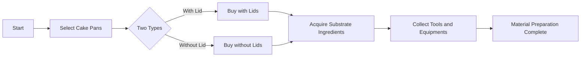
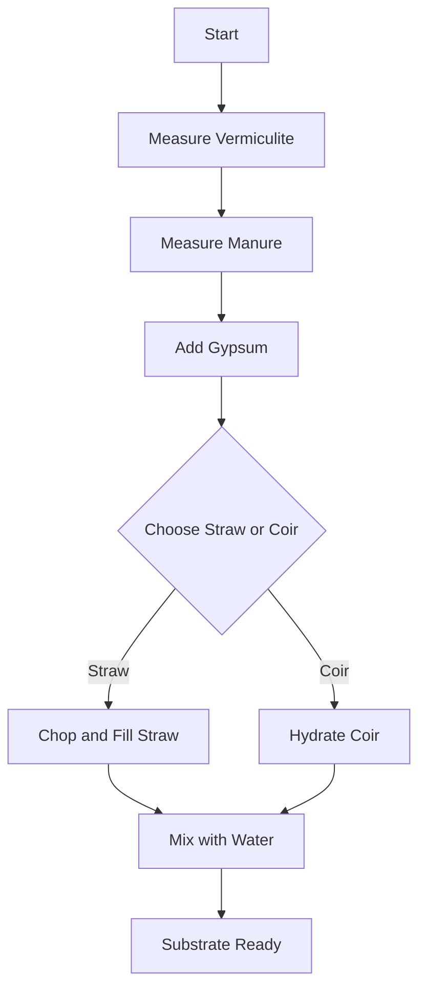
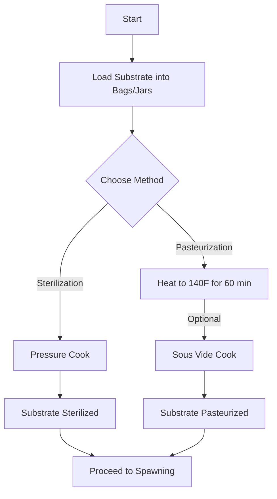
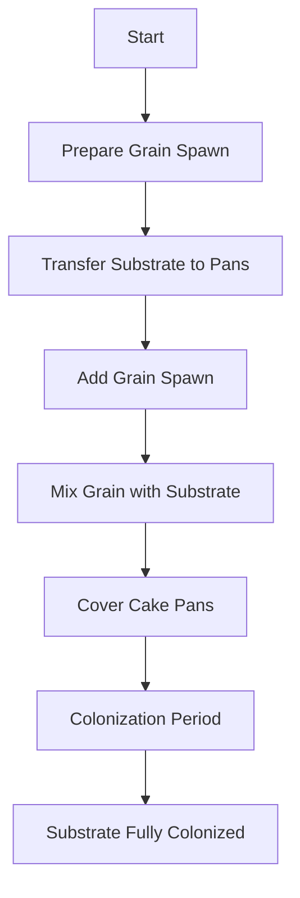
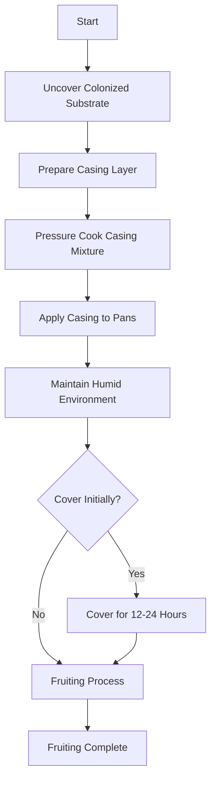

https://www.youtube.com/watch?v=cl5FSrIraA4

Making Pan Cyan's 100% automated!! | Set & Forget!

Betsy
Creating a comprehensive study guide from the provided video transcript requires summarizing the key concepts and steps involved in the new "set it and forget it" method for cultivating difficult fungi, specifically Panaeolus cyanescens, also known as "pan cyans" or "pan canyons". Below is a summary of the main points:

Overview
The lecture is about a simplified cultivation technique for experienced cultivators looking for a challenge and higher yield.
Panaeolus cyanescens has been known as a finicky mushroom to cultivate, but the method discussed aims to make it as easy as other fungi.
The complete guide can only be found on the speaker's Patreon due to YouTube's content restrictions.
Equipment Needed
Bins with lids: the dimensions of the bins are crucial for proper humidity control.
Aquarium pump: used with air stones to provide airflow and maintain humidity.
Cultivation trays: Two-inch deep trays are recommended to limit substrate and casing height.
Pint jars: One per bin for water to be used with the air stones.
Drill bits (9/64" and 1/4"): For creating FAE (Fresh Air Exchange) holes in the bins.
Setting up the Bins
Mark and drill FAE holes two inches apart and up from the base of the bin using a 9/64" drill bit.
Drill a center hole with a 1/4" drill bit near the top of one long side of each bin.
Place a pint glass filled with water in each bin, and put the air stones from the aquarium pump into the water.
Cultivation Process (Detailed on Patreon)
Spawn grains and substrate in the trays.
Once fully colonized, add a casing layer and place the trays in the modified bin setup.
The system is hands-off, with no need for further misting or fanning.
Expected Results
Within five to ten days after setting up in the fruiting environment, pins should begin to arise.
Different Panaeolus strains and other fungi like Mexicana, Galindoi, and Tampensis can be grown with this method.
Harvest when the fruits are ready.
Summary
The study guide covers the necessary equipment setup for a self-sufficient fruiting environment, ideal for those looking to grow Panaeolus cyanescens and similar fungi. The importance of specific equipment dimensions and setup is emphasized, as well as the ease of maintenance once the system is operational. For the full step-by-step guide, including spawning, colonization, fruiting, and harvesting, viewers are directed to the speaker's Patreon.

# Fungi Substrate Preparation Guide

## 1. Materials Preparation

### Required Materials
- Five 13x9x2 foil cake pans
- Ingredients for substrate (vermiculite, manure, gypsum, straw or coco coir, hot tap water)
- Other tools (bucket, scissors, etc.)

### Flowchart: Material Gathering

2. Substrate Preparation
Steps
Fill a cake pan half-way with vermiculite.
Fill another cake pan to the top with field-aged horse or cow manure.
Add 1/4 cup gypsum.
Prepare two cake pans of chopped straw, or hydrate 300g coco coir.
Measure and add hot tap water.

3. Sterilization/Pasteurization
Steps
Load the prepared substrate into mycobags or large glass jars.
For sterilization, pressure cook for 1.5 hours at 17psi or 2 hours at 15psi.
For pasteurization, heat the substrate to 140F and maintain for 60 minutes.
Optionally use a sous vide cooker for pasteurization for 5 hours or overnight.

4. Spawning and Colonization
Steps
Prepare grain spawn by shaking.
Transfer substrate to cake pans, filling 3/4 full.
Add 0.5 to 1 lb. of grain spawn per pan.
Mix the grain spawn into the substrate.
Cover cake pans with tin foil or clear top lid.
Allow to colonize at 70-85F for about 4-7 days.

5. Casing and Fruiting
Steps
Uncover colonized substrate and add casing layer.
Prepare casing layer with peat moss, vermiculite, and calcium hydroxide.
Pressure cook casing mixture for 30 minutes.
Apply a thin layer of casing to each pan.
Maintain in a clean, humid environment for fruiting.
Optional: cover with top for 12-24 hours initially.

5-6 pans:
Fill cake pan HALF FULL w/ vermiculite
    Use volume measurements; 9x13x2 ~= 3300mL
Fill one pan full of manure
Fill 2 pans chopped straw (or 300g coco coir w/ 3L H2O)
Hot tap water, 2500mL +/-

4 straw/hydrated coir : 2 manure : 1 vermiculite : some gypsum

Mix

Sterilize @140F (60C) 2hr
Use immediately or in up to 2 weeks

0.5-1 lb grain spawn for each cake (3/4 full of substrate); more grain = faster colonization
Mix throughly, even and level, patted but not packed, no straws poking up

lid w/ plastic canopy or foil w/ 6 small holes
70-85F for 4-7 days

CASING LAYER
2L peat moss
2L vermiculite
15g calcium hydroxide OR 40g calcium carbonate
1L H2O
Pressure Cook 