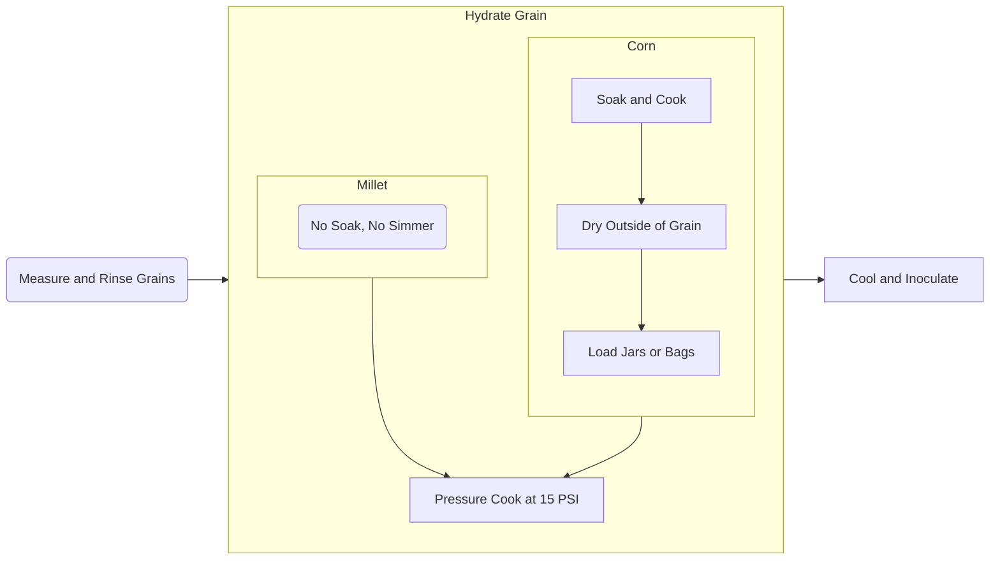
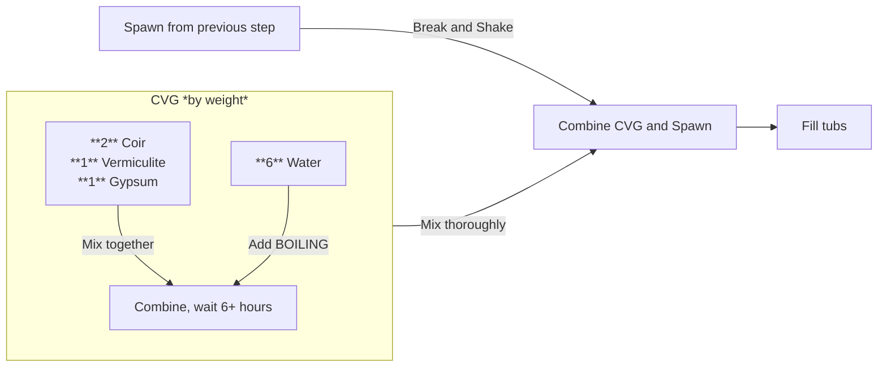

# Shroomiversity Recipe Handout

## Overview
Grow mushrooms in five steps:
1. **Grain Spawn**: Hydrate, sterilize, inoculate, and colonize.
2. **Bulk Substrate**: Hydrate coir, vermiculite, and gypsum (CVG) to field capacity.
3. **Fruiting**: Adjust conditions for mushroom growth.

---

---

### Quick Tips:
- Keep everything clean to prevent contamination.
- Use breathable lids during sterilization and colonization.
- Target 57% hydration for grains consistently throughout.

-------

### Material Calculations (grams)
| Tubs | Dry Grain | **Colonized Grain Spawn** | Coco Coir | Vermiculite | Gypsum | **CVG Subtotal** | ***Tub Total*** |
|------|-----------|---------------------------|-----------|-------------|--------|------------------|-----------------|
| 1    | 225       | **350**                   | 250       | 125         | 125    | **1350**         | ***1700***      |
| 4    | 900       | **1400**                  | 1000      | 500         | 500    | **5400**         | ***6800***      |
| 8    | 1800      | **2800**                  | 2000      | 1000        | 1000   | **10800**        | ***13600***     |

---

## 1. **Grain Spawn**

---

### Millet (No-Soak, No-Simmer):
1. **Measure and Rinse**:
   - Weigh dry millet grain
     - (400g per 2qt mason jar).
   - Rinse thoroughly until water runs clear.
   - Measure the rinsed millet to check how much water to add. 
     - ***Sample Calculation:***
       - Dry millet = 400 g
         - 400 g millet * 57% hydration = ***228 g water TARGET***
       - Post-rinse millet = 420 g
         - **20 g water CLINGING** to the grain
       - 228 g target - 20 g clinging = ***208 g TO ADD***
       - *Add 208g of water to the jar.*
      - Divide millet evenly to jars (no more than *400 g* in a 2 qt Mason jar)
      - Divide water to add by how many jars
2. **Hydrate**:
   - Add water to adjust to a **1 : 0.57** hydration ratio based on the dry millet weight.
     - Hydration % = \[ Water Weight / Dry Weight \] × 100

     - Water Weight = (Final Weight - Dry Weight)
   - Seal with breathable lids.
3. **Sterilize**:
   - Pressure cook at 15 PSI for 90 minutes.

### Corn (Drippy Corn):
1. **Measure and Rinse**:
   - Weigh dry corn grain.
   - Rinse thoroughly until water runs clear.
2. **Hydrate**:
   - Add rinsed corn to pressure cooker with water (cover to knuckle height).
   - Add 1/4 cup corn syrup per 2 kg corn.
   - Heat until pressure weight rocks; let cool.
   - Drain and spread to dry until slightly tacky.
3. **Sterilize**:
   - Pressure cook at 15 PSI for 90 minutes.

---

## 2. **Bulk Substrate**

---

### Ratios (by weight):
- **2** coir : **1** vermiculite : **1** gypsum : **6** water
- **Grain Spawn : Bulk Substrate** = **1 : 4**

### Steps:
1. **Hydrate**:
   1. Break up coir, mix with vermiculite and gypsum.
   2. Add boiling water to the CVG mixture.
   3. Mix well to ensure even hydration.
   4. Allow to stand for at least 6 hours.
   5. Test field capacity (squeeze test: a few drops).
2. **Mix Grain Spawn and Substrate**
   - Add colonized grain spawn to hydrated CVG substrate in tubs.
   - Mix thoroughly for even distribution.
4. **Fill and Level**:
   - Spread the mixture evenly in the tub.
   - Compact the outer edge of the mixture.
   - Re-level the mixture to fill in the edges.
   - Lightly compact the entire tub and level as needed.

---

## 3. **Fruiting**

---

1. **Colonize**:
   - Close the tub lid and let mycelium colonize the substrate fully (1–2 weeks).
   - Keep conditions clean and avoid opening the tub unnecessarily.

1. **Fruiting Conditions**:
   - Once colonized, introduce fresh air and light.
     - Can just flip the lid!
   - Maintain high humidity and watch for pin formation.
     - Mist lightly if needed; most won't.
2. **Harvest**:
   - Pick mushrooms when caps flatten or just before veil breaks.
   - Dehydrate 125F for 12 hours or until cracker-dry

---

**Mush Love from Shroomiversity!**

